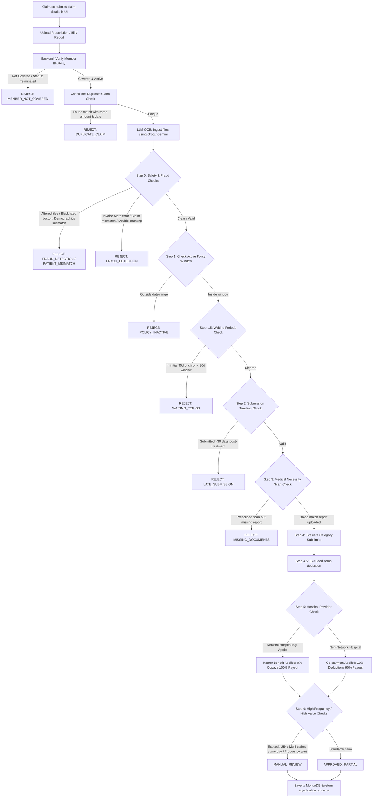

# ClaimSense AI — Automated Insurance Claims Adjudication Platform

ClaimSense AI is a premium, full-stack claims auditing platform designed to automate the ingestion, validation, and adjudication of Outpatient Department (OPD) medical insurance claims. 

By pairing advanced multimodal LLM vision OCR (Groq & Gemini) with a highly customized, deterministic policy rules engine, ClaimSense AI eliminates manual paper processing, detects invoice fraud, validates medical necessity, and computes payouts in real time.

---

## 🎨 System Architecture & Adjudication Pipeline



---

## ⚡ Key Features

*   **Multimodal LLM OCR Ingestion (Groq & Gemini)**: Extracts structured text (patient name, diagnostic findings, line items, doctor registration) directly from uploaded files.
*   **Sequential Pacing & Rate-Limiting Delays**: Backend document extraction introduces a `1500ms` sleep delay between files and incorporates exponential backoff retries to prevent triggering API rate limits.
*   **Resilient Cascade Fallback Chain**: 
    1.  **Primary**: Live Groq API (`meta-llama/llama-4-scout-17b-16e-instruct` Vision).
    2.  **Secondary**: Live Gemini API (`gemini-2.5-flash` Vision).
    3.  **Tertiary**: Local mock fallback matching `test_cases.json` scenario variables.
*   **Safety & Fraud Detection**:
    *   **Demographic checks**: Catches gender/age discrepancies (e.g. pregnancy diagnosis on males, senile dementia on children).
    *   **Invoice Math Audits**: Programmatically matches sum of itemized lines against invoice subtotal, taxes, and final payable amount.
    *   **Double-Counting Audit**: Detects if category headers and individual line items are concurrently added to inflate the bill.
    *   **Blacklist Matching**: Detects registered doctor IDs and names associated with fraud or fake stamps.
*   **Admin Override & Audit Ledger**: Admin dashboard with filters, manual adjudication status overrides, and a toggleable TechCorp Employee Directory.
*   **Document Preview Modal**: Interactive previews for uploaded images and PDFs, featuring automatic blob memory management.

---

## 📁 Repository Structure

```
ClaimSense-AI/
├── client/                     # Vite + React + TypeScript + Tailwind CSS Frontend
├── server/                     # Node.js + Express + Mongoose Backend
│   ├── models/                 # MongoDB Mongoose Schemas (Claim, Employee, Policy)
│   ├── routes/                 # API Routes (claimRoutes.js)
│   ├── scripts/                # Database Seeder (seed_db.js) & Test Runner (test_runner.js)
│   ├── services/               # Rules Engine (rulesEngine.js) & LLM Client (llmService.js)
│   └── test_cases.json         # Backend Test Cases reference file
└── plum_intern_assignment/     # Assignment instructions and policy terms reference data
```

---

## 🚀 Getting Started

Follow these steps to run the frontend and backend locally.

### 1. Prerequisites
*   **Node.js** (v18 or higher)
*   **MongoDB** (Local instance or MongoDB Atlas cluster connection string)
*   **API Key**: Groq API Key or Gemini API Key (Optional — fallback is enabled)

---

### 2. Environment Configuration (`/server/.env`)

1.  Navigate to the server folder and copy the environment template:
    ```bash
    cd server
    cp .env.example .env
    ```
2.  Configure your environment variables in `.env`:
    *   `MONGODB_URI`: Connect to a local MongoDB database (`mongodb://localhost:27017/claimsense`) or Atlas cluster.
    *   `GROQ_API_KEY`: Provide your Groq key.
    *   `GEMINI_API_KEY`: Provide your Gemini key (secondary fallback).
    *   `CLOUDINARY_CLOUD_NAME`, `CLOUDINARY_API_KEY`, `CLOUDINARY_API_SECRET`: (Optional) Connect Cloudinary for file storage. If left blank, documents will save locally under `server/uploads/`.

---

### 3. Backend Setup & DB Seeding

1.  Install dependencies:
    ```bash
    npm install
    ```
2.  Seed the MongoDB database with default policies, network hospitals, and employee directory profiles:
    ```bash
    npm run seed
    ```
3.  Start the backend development server:
    ```bash
    npm run dev
    ```
    The server will run on `http://localhost:5000`.

---

### 4. Run the Automated Test Suite

We have integrated the automated test suite directly into `npm test` so you can verify the rules engine rules instantly:
```bash
npm test
```
This script evaluates the rules engine logic against all 10 historical test cases and prints a pass/fail matrix, checking for copays, category limits, waiting periods, fraud flags, and network hospital calculations.

---

### 5. Frontend Setup

1.  Open a new terminal window and navigate to the client folder:
    ```bash
    cd ../client
    npm install
    ```
2.  Start the Vite development server:
    ```bash
    npm run dev
    ```
    Open your browser to `http://localhost:5173`.

---

## 🏥 Policy Rules & Claim Processing Guidelines

*   **Co-payment & Network Discount**:
    *   **Network Hospital** (Apollo, Fortis, Max, Manipal, Narayana): Applies **0% co-payment** and **20% provider discount** (Insurer benefit). The member receives a **100% full reimbursement** of eligible base costs.
    *   **Non-Network Hospital**: Applies a **10% co-payment deduction** from the member's reimbursement payout.
*   **Waiting Periods**:
    *   **Initial**: 30 days from joining date (covers accidental emergency treatments only).
    *   **Chronic (Diabetes / Hypertension)**: 90 days from joining date.
*   **Exclusions**: Cosmetic procedures (e.g. teeth whitening) and weight loss/obesity treatments are programmatically detected and deducted from the eligible claim amount.
*   **Diagnostics Scan Verification**: Scan charges (MRI, CT Scan, X-ray, Ultrasound, CBC, ECG) require matching diagnostic reports. Mismatching patient names, incorrect test types, or missing reports trigger rejection.